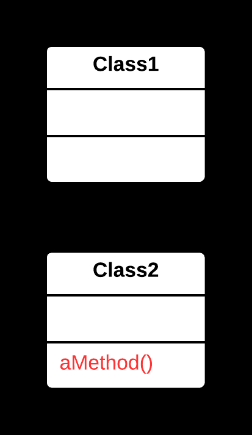

# Create a new method in the class that uses the method the most, then move code from the old method to there. Turn the code of the original method into a reference to the new method in the other class or else remove it entirely.

